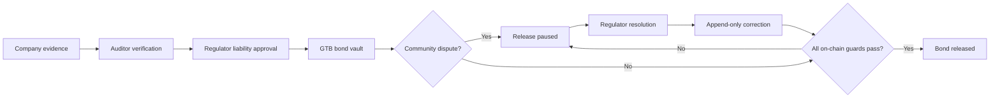

# GroundTruth — Dynamic Restoration Bond


GroundTruth는 기업이 개발 활동을 마친 부지를 복원하는 과정에서 **증거, 책임 금액, 커뮤니티 분쟁, 규제기관 결정, 복원 보증금**을 하나의 공개된 감사 기록으로 연결하는 Solana 기반 데모입니다.

이 저장소는 GroundTruth 팀의 UBC Blockchain Blockathon 프로토타입입니다. 현재 데모는 Solana **Devnet**에 배포되어 있으며 실제 화폐나 Mainnet 자산을 사용하지 않습니다.

> Devnet SOL과 GTB는 테스트 전용이며 금전적 가치가 없습니다. 이 프로젝트가 생성한 지갑에는 실제 SOL, 토큰 또는 NFT를 보내지 마세요.

## 현재 배포 상태

| 항목 | 값 |
| --- | --- |
| Network | Solana Devnet |
| Program ID | `E33zGy2Sb8qYU4uRMzH59EqCq6Ut75oj8DjUMeTtLXvQ` |
| Seeded project | `J1bGEwZ2BAUtDHKHHVWZPH12SDXj82VPUL7BefiCTozF` |
| Demo liability | `125,000 GTB` |
| Initial state | Active dispute, release paused |

- [Program on Solana Explorer](https://explorer.solana.com/address/E33zGy2Sb8qYU4uRMzH59EqCq6Ut75oj8DjUMeTtLXvQ?cluster=devnet)
- [Seeded project on Solana Explorer](https://explorer.solana.com/address/J1bGEwZ2BAUtDHKHHVWZPH12SDXj82VPUL7BefiCTozF?cluster=devnet)

`public/demo-config.json`에는 이 공개 Devnet 프로젝트를 읽는 데 필요한 공개 주소만 들어 있습니다. 서명 가능한 private key는 저장소에 포함되지 않습니다.

## 데모에서 보여주는 것

1. 회사가 복원 증거와 수정된 증거를 제출합니다.
2. 독립 Auditor가 증거를 반려하거나 검증합니다.
3. Regulator가 검증된 증거에 연결된 복원 책임 금액을 승인합니다.
4. 회사가 PDA 소유 SPL Token vault에 125,000 GTB를 예치합니다.
5. Community가 독립 수질 보고서를 근거로 분쟁을 제기합니다.
6. 프로그램이 본드 릴리스를 즉시 중단합니다.
7. Regulator가 분쟁을 해결하고 append-only correction을 추가합니다.
8. 모든 guard가 통과했을 때만 실제 vault 잔액이 수령 계정으로 이동합니다.



## 핵심 구현

- Phantom 연결, 주소 기반 역할 판별, 실시간 Solana account 조회
- 실제 Regulator 서명이 필요한 분쟁 해결, correction 추가, bond release
- Anchor 프로그램의 authority 검증과 PDA 기반 append-only 기록
- PDA가 소유하는 legacy SPL Token vault
- active dispute와 correction requirement에 따른 원자적 bond pause
- liability revision, 승인 결정, 실제 vault balance를 다시 확인하는 release guard
- 프로젝트 단위 event sequence와 Solana Explorer 링크
- 복원 전·후 드론 사진, 커뮤니티 수질 조사 사진, PDF, CSV, JSON metadata, SHA-256 manifest
- Rust release-guard 단위 테스트와 재현 가능한 Devnet seed 스크립트

## 기술 스택

- Solana / Agave `4.2.1`
- Anchor CLI `1.1.2`, Anchor TypeScript client `0.32.1`
- Rust + SBPF v3 platform tools `v1.54`
- Node.js `22.13+`, TypeScript, React 19, Next.js-compatible Vinext
- Phantom browser extension
- Cloudflare Workers-compatible Sites build

버전 기준은 `Anchor.toml`과 `package.json`에서 확인할 수 있습니다.

## 저장소 구조

```text
app/                         Dashboard UI
lib/use-groundtruth.ts       Phantom 및 Anchor client integration
lib/restoration_bond.json    Frontend용 Anchor IDL
programs/restoration_bond/   Rust on-chain program
scripts/demo-*.ts            키 생성, seed, status, fallback transactions
public/demo-config.json      현재 공개 demo account 주소와 RPC 설정
public/demo-evidence/        합성 환경 증거 pack과 SHA-256 manifest
docs/architecture.md         Authority 및 release-guard 설계
docs/demo-script.md          발표 진행 순서
```

---

## 새로 클론한 사람: 기존 Devnet 데모 보기

이 방법은 체크인된 `public/demo-config.json`의 기존 프로젝트를 **읽기 전용**으로 실행합니다. 별도의 Solana 지갑이나 Faucet이 필요하지 않습니다.

### 1. 클론 및 의존성 설치

```bash
git clone <REPOSITORY_URL>
cd dynamic-restoration-bond
npm ci
```

### 2. 프로덕션 웹 서버 실행

Vinext 개발 모드는 일부 환경에서 RSC stream 오류가 날 수 있으므로 데모에는 production build를 권장합니다.

```bash
npm run build
npm run start
```

터미널에 출력된 주소를 Chrome에서 엽니다.

```text
http://localhost:3000
```

3000번 포트를 이미 사용 중이면 3001 또는 다음 빈 포트가 출력됩니다. 터미널에 실제로 표시된 주소를 사용하세요.

### 3. 정상 상태 확인

왼쪽 아래에 다음이 표시되어야 합니다.

```text
Solana Devnet
On-chain sync active
```

새 클론에는 기존 Regulator private key가 없으므로 기존 프로젝트의 마지막 세 트랜잭션은 서명할 수 없습니다. 직접 조작하려면 다음 절차로 자신만의 demo project를 seed합니다.

---

## 새로 클론한 사람: 자신만의 Devnet 시나리오 만들기

배포된 GroundTruth 프로그램을 재사용하므로 5 SOL 규모의 program deploy는 필요하지 않습니다. 새 역할 계정과 프로젝트 계정을 만들 정도의 무료 Devnet SOL만 필요합니다.

### 사전 준비

다음을 설치합니다.

- Node.js 22.13 이상
- Rust stable
- Solana CLI 4.2.1
- Anchor CLI 1.1.2
- Google Chrome
- [Phantom Chrome extension](https://phantom.com/download)

설치 확인:

```bash
node --version
npm --version
rustc --version
solana --version
anchor --version
```

### 1. 로컬 demo key 생성

```bash
npm run demo:keys
npm run demo:addresses
```

다섯 계정이 `.demo-wallets/`에 생성됩니다.

| 계정 | 역할 |
| --- | --- |
| `deployer` | 역할 계정 funding, mint 및 seed 비용 지불 |
| `company` | 프로젝트, 증거, liability proposal, bond deposit |
| `auditor` | 증거 반려 및 검증 |
| `regulator` | liability 승인, 분쟁 해결, correction, release |
| `community` | 승인 결정에 대한 분쟁 개시 |

`.demo-wallets/`는 `.gitignore`에 포함되어 있습니다. 이 디렉터리를 공유하거나 커밋하지 마세요.

### 2. Deployer 주소에 무료 Devnet SOL 받기

`npm run demo:addresses`에 출력된 **자신의 deployer 주소**를 복사합니다. 기존 저장소 관리자의 주소를 사용하면 안 됩니다.

[Solana Foundation Devnet Faucet](https://faucet.solana.com/)에서 약 1.2–2 Devnet SOL을 요청합니다.

```bash
solana balance <YOUR_DEPLOYER_ADDRESS> --url devnet
```

Devnet SOL은 실제 가치가 없으며 Mainnet으로 전송할 수 없습니다. 실제 SOL이나 거래소 자산을 보내지 마세요.

### 3. 새로운 Devnet 프로젝트 seed

공용 RPC의 429를 피하기 위해 transaction 사이에 2.5초 간격을 둡니다.

```bash
env \
  GROUNDTRUTH_RPC_URL=https://api.devnet.solana.com \
  GROUNDTRUTH_RPC_PAUSE_MS=2500 \
  npm run demo:seed
```

성공 출력:

```text
Project ... seeded in disputed state.
Regulator <YOUR_REGULATOR_ADDRESS>
Release guard during active dispute: VERIFIED
```

이 명령은 다음을 실제 Devnet에 생성합니다.

- 0-decimal GTB mint
- Company associated token account
- Project와 bond PDA
- 반려된 evidence revision과 검증된 resubmission
- 승인된 liability revision 01
- 125,000 GTB가 들어 있는 vault
- active community dispute
- 새 주소가 반영된 `public/demo-config.json`

### 4. 상태 확인

```bash
npm run demo:status
```

기대 상태:

```text
cluster: 'devnet'
activeDisputes: 1
outstandingCorrections: 0
liability: '125000'
revision: '1'
bondStatus: 'releasePaused'
vaultBalance: '125000'
releasedAmount: '0'
```

### 5. Regulator 계정을 Phantom에 가져오기

화면 공유를 끈 상태에서 실행합니다.

```bash
npm run demo:regulator-key
```

출력된 private key는 복사 후 외부에 공유하지 않습니다.

Phantom에서:

1. Profile → Add Account → Import Private Key
2. 이름: `GroundTruth Regulator`
3. Network: `Solana`
4. 출력된 demo private key 붙여넣기
5. Settings → Developer Settings → Testnet Mode 켜기
6. `Solana Devnet` 선택
7. `GroundTruth Regulator` 계정 선택

시드가 성공했다면 Regulator에는 소량의 Devnet SOL이 있어 Phantom이 수수료를 시뮬레이션할 수 있습니다.

### 6. 변경된 config로 웹 앱 실행

```bash
npm run build
npm run start
```

Chrome에서 출력된 URL을 열고 `Connect Phantom`을 누릅니다. 다음 세 항목을 확인합니다.

```text
Solana Devnet
On-chain sync active
Regulator access
```

### 7. 실제 시연 트랜잭션

다음 순서로 각 Phantom 요청을 승인합니다.

1. `Review dispute`
2. `Record resolution on-chain`
3. `Append correction`
4. `Release bond`

각 단계가 끝나면 UI가 account를 다시 읽고 다음 상태로 이동합니다.

```text
disputed
→ correction-required
→ release-ready
→ released
```

모든 트랜잭션은 `Latest transaction` 링크로 Devnet Explorer에서 확인할 수 있습니다.

### CLI fallback

Phantom 팝업 문제가 있을 때 동일한 Regulator key로 남은 단계를 실행할 수 있습니다.

```bash
npm run demo:advance -- all
```

완료 후 웹페이지를 새로고침하세요. 이미 완료된 단계는 건너뜁니다.

---

## 저장소 관리자: 프로그램 다시 배포하기

현재 프로그램은 이미 Devnet에 배포되어 있으므로 일반 사용자는 이 절차가 필요하지 않습니다.

초기 배포에는 현재 453KB artifact 기준 약 3.16 Devnet SOL의 program-data rent와 seed 비용이 필요합니다. 관리자는 약 5 Devnet SOL을 준비합니다.

```bash
npm run anchor:build
npm run demo:deploy:devnet
```

대형 프로그램은 수백 개의 upload transaction으로 나뉩니다. 스크립트는 `--max-sign-attempts 20`으로 blockhash 만료 시 다시 서명하며, 실패하면 `target/deploy/restoration_bond-upgrade-buffer.json`을 이용해 다음 실행에서 이어서 업로드합니다.

> Fresh clone에는 현재 Program ID를 처음 생성한 program keypair가 포함되지 않습니다. 같은 Program ID의 신규 배포나 upgrade는 기존 authority/keypair를 보유한 관리자만 할 수 있습니다. Fork에서 새 프로그램을 배포하려면 새 program keypair를 만들고 `declare_id!`, `Anchor.toml`, `scripts/demo-common.ts`, IDL의 Program ID를 함께 변경해야 합니다.

배포 확인:

```bash
solana --keypair .demo-wallets/deployer.json \
  program show E33zGy2Sb8qYU4uRMzH59EqCq6Ut75oj8DjUMeTtLXvQ \
  --url devnet
```

---

## 개발 및 검증

프론트엔드 검사:

```bash
npm run typecheck
npm run lint
npm run build
```

Rust program 테스트:

```bash
cargo test --workspace
```

SBPF v3 artifact와 IDL 재생성:

```bash
npm run anchor:build
npm run anchor:idl
cp target/idl/restoration_bond.json lib/restoration_bond.json
```

현재 Rust 테스트는 다음 release 조건을 검증합니다.

- active dispute가 있으면 release 실패
- outstanding correction이 있으면 release 실패
- liability revision이 오래됐으면 실패
- 실제 vault balance가 부족하면 실패
- 모든 guard가 통과하면 release 성공

## 환경 설정

CLI script는 다음 변수를 사용합니다.

```bash
GROUNDTRUTH_RPC_URL=https://api.devnet.solana.com
GROUNDTRUTH_RPC_PAUSE_MS=2500
```

Frontend는 환경 변수가 아니라 seed가 생성하는 `public/demo-config.json`을 읽습니다. 이 파일에는 RPC URL, 공개 account 주소, 역할의 공개키, evidence URI와 hash만 들어가야 합니다.

## 자주 발생하는 문제

### `429 Too Many Requests`

공용 Devnet RPC 호출 한도를 초과한 상태입니다. 연속으로 실행하지 말고 몇 분 기다린 다음 RPC가 응답하는지 확인합니다.

```bash
solana balance <YOUR_DEPLOYER_ADDRESS> --url devnet
```

응답이 돌아오면 `GROUNDTRUTH_RPC_PAUSE_MS=2500`으로 seed를 다시 실행합니다. 반복적으로 발생하면 Helius 또는 QuickNode 같은 별도 Devnet RPC를 사용하세요.

### `Blockhash expired`

프로그램 upload transaction 수가 blockhash 유효 시간 안에 처리되지 않은 것입니다. `demo:deploy:devnet`은 최대 20회 재서명하도록 설정돼 있습니다. 최종 실패해도 buffer keypair를 삭제하지 말고 같은 명령을 다시 실행합니다.

### Phantom에는 SOL이 0으로 보이지만 CLI에는 로컬 SOL이 있음

Phantom은 localhost validator의 SOL 잔액을 표시하지 않습니다. 브라우저 서명 시연은 Devnet을 사용하세요. Localnet SOL과 Devnet SOL은 서로 다른 원장에 존재하며 이동할 수 없습니다.

### Phantom에서 `SOL이 충분하지 않습니다`

Phantom의 Testnet Mode가 `Solana Devnet`인지, 선택 주소가 seed output의 Regulator 주소와 같은지 확인합니다.

```bash
solana balance <YOUR_REGULATOR_ADDRESS> --url devnet
```

### `Unhandled Script Error: RSC stream closed`

데모에는 `npm run dev` 대신 아래 production server를 사용합니다.

```bash
npm run build
npm run start
```

### `No default signer found`

프로그램 조회 시 repository의 demo key를 명시합니다.

```bash
solana --keypair .demo-wallets/deployer.json program show <PROGRAM_ID> --url devnet
```

## 증거 파일

`public/demo-evidence/`의 모든 자료는 합성된 가상 데이터입니다.

- 복원 전 드론 사진
- 복원 후 드론 사진
- 커뮤니티 수질 채취 사진
- 가상 수질 검사 PDF
- 식생 분석 CSV
- 프로젝트 및 evidence metadata JSON
- `SHA256SUMS.txt`

이미지에는 `SIMULATED DEMO EVIDENCE` 표시가 있으며 과학적·규제적 판단에 사용하면 안 됩니다.

## 보안 원칙

- `.demo-wallets/`, `target/`, `.env*`는 Git에 커밋하지 않습니다.
- private key, seed phrase, recovery phrase를 README, 이슈, 채팅 또는 발표 화면에 노출하지 않습니다.
- demo wallet에 실제 Mainnet SOL이나 자산을 보내지 않습니다.
- `public/demo-config.json`에는 공개 정보만 저장합니다.
- Devnet token과 demo GTB를 실제 금융 상품으로 표현하지 않습니다.

## 한계와 면책

GroundTruth는 승인된 사람의 결정과 증거 hash, 책임 revision, bond workflow를 기록하고 강제합니다. 블록체인이 환경 주장 자체의 과학적 진실성을 판정하지는 않습니다.

현재 P0 데모는 다음 범위로 제한됩니다.

- zero-decimal legacy SPL Token 기반 GTB
- 한 번의 full release
- partial release와 slashing 미구현
- 합성 evidence와 가상 North Ridge 프로젝트
- Devnet 또는 local development 전용

설계 세부 사항은 [`docs/architecture.md`](docs/architecture.md), 발표 흐름은 [`docs/demo-script.md`](docs/demo-script.md)에서 확인할 수 있습니다.
