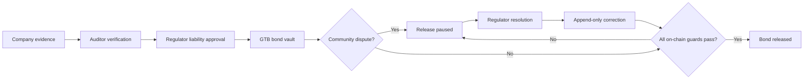

# GroundTruth — Dynamic Restoration Bond


GroundTruth is a Solana-based demo that connects **restoration evidence, liability amounts, community disputes, regulator decisions, and restoration bonds** in a single public audit trail for sites affected by corporate development activities.

This repository contains the GroundTruth team's prototype for the UBC Blockchain Blockathon. The current demo is deployed on Solana **Devnet** and does not use real currency or Mainnet assets.

> Devnet SOL and GTB are for testing only and have no monetary value. Do not send real SOL, tokens, or NFTs to any wallet created by this project.

## Current Deployment

| Item | Value |
| --- | --- |
| Network | Solana Devnet |
| Program ID | `E33zGy2Sb8qYU4uRMzH59EqCq6Ut75oj8DjUMeTtLXvQ` |
| Seeded project | `J1bGEwZ2BAUtDHKHHVWZPH12SDXj82VPUL7BefiCTozF` |
| Demo liability | `125,000 GTB` |
| Initial state | Active dispute, release paused |

- [Program on Solana Explorer](https://explorer.solana.com/address/E33zGy2Sb8qYU4uRMzH59EqCq6Ut75oj8DjUMeTtLXvQ?cluster=devnet)
- [Seeded project on Solana Explorer](https://explorer.solana.com/address/J1bGEwZ2BAUtDHKHHVWZPH12SDXj82VPUL7BefiCTozF?cluster=devnet)

`public/demo-config.json` contains only the public addresses required to read this Devnet project. No signing private keys are included in the repository.

## What the Demo Shows

1. A company submits restoration evidence and a revised evidence package.
2. An independent auditor rejects or verifies the evidence.
3. A regulator approves the restoration liability amount linked to the verified evidence.
4. The company deposits 125,000 GTB into a PDA-owned SPL Token vault.
5. The community opens a dispute based on an independent water-quality report.
6. The program immediately pauses the bond release.
7. The regulator resolves the dispute and appends an immutable correction.
8. The actual vault balance moves to the recipient account only after every release guard passes.



## Core Implementation

- Phantom connection, address-based role detection, and live Solana account reads
- Dispute resolution, correction recording, and bond release requiring a real regulator signature
- Anchor authority validation and PDA-based append-only records
- A legacy SPL Token vault owned by a PDA
- Atomic bond pause based on active disputes and correction requirements
- Release guards that recheck the liability revision, approval decision, and actual vault balance
- Project-level event sequencing and Solana Explorer links
- Before-and-after drone images, a community water-sampling image, PDF, CSV, JSON metadata, and a SHA-256 manifest
- Rust unit tests for release guards and a reproducible Devnet seed script

## Technology Stack

- Solana / Agave `4.2.1`
- Anchor CLI `1.1.2`, Anchor TypeScript client `0.32.1`
- Rust with SBPF v3 platform tools `v1.54`
- Node.js `22.13+`, TypeScript, React 19, and Next.js-compatible Vinext
- Phantom browser extension
- Cloudflare Workers-compatible Sites build

See `Anchor.toml` and `package.json` for the exact project requirements.

## Repository Structure

```text
app/                         Dashboard UI
lib/use-groundtruth.ts       Phantom and Anchor client integration
lib/restoration_bond.json    Anchor IDL used by the frontend
programs/restoration_bond/   Rust on-chain program
scripts/demo-*.ts            Key generation, seed, status, and fallback transactions
public/demo-config.json      Public demo account addresses and RPC configuration
public/demo-evidence/        Synthetic environmental evidence pack and SHA-256 manifest
docs/architecture.md         Authority and release-guard design
docs/demo-script.md          Presentation walkthrough
```

---

## New Contributors: View the Existing Devnet Demo

This option runs the project stored in `public/demo-config.json` in **read-only mode**. It does not require a Solana wallet or faucet funds.

### 1. Clone and install dependencies

```bash
git clone https://github.com/Blockchain-UBC-GroundTruth/dynamic-restoration-bond.git
cd dynamic-restoration-bond
npm ci
```

### 2. Start the production web server

Vinext development mode can produce an RSC stream error in some environments, so the production build is recommended for demos.

```bash
npm run build
npm run start
```

Open the address printed in the terminal in Chrome:

```text
http://localhost:3000
```

If port 3000 is already in use, the terminal will show port 3001 or the next available port. Use the address actually printed in your terminal.

### 3. Confirm the connection

The bottom-left corner of the app should display:

```text
Solana Devnet
On-chain sync active
```

A fresh clone does not contain the existing regulator's private key, so it cannot sign the final transactions for the seeded project. To run the interactive flow, seed a new demo project with your own role accounts by following the next section.

---

## New Contributors: Create Your Own Devnet Scenario

This process reuses the deployed GroundTruth program, so you do not need the approximately 5 Devnet SOL required to deploy the program itself. You only need enough free Devnet SOL to create new role and project accounts.

### Prerequisites

Install the following tools:

- Node.js 22.13 or later
- Rust stable
- Solana CLI 4.2.1
- Anchor CLI 1.1.2
- Google Chrome
- [Phantom Chrome extension](https://phantom.com/download)

Verify the installations:

```bash
node --version
npm --version
rustc --version
solana --version
anchor --version
```

### 1. Generate local demo keys

```bash
npm run demo:keys
npm run demo:addresses
```

Five accounts are created in `.demo-wallets/`.

| Account | Role |
| --- | --- |
| `deployer` | Funds role accounts and pays mint and seed costs |
| `company` | Creates the project, evidence, liability proposal, and bond deposit |
| `auditor` | Rejects and verifies evidence |
| `regulator` | Approves liability, resolves disputes, records corrections, and releases the bond |
| `community` | Opens a dispute against an approved decision |

`.demo-wallets/` is included in `.gitignore`. Never share or commit this directory.

### 2. Request free Devnet SOL for the deployer

Copy **your own deployer address** from `npm run demo:addresses`. Do not use an address belonging to a repository maintainer.

Request approximately 1.2–2 Devnet SOL from the [Solana Foundation Devnet Faucet](https://faucet.solana.com/).

```bash
solana balance <YOUR_DEPLOYER_ADDRESS> --url devnet
```

Devnet SOL has no real value and cannot be transferred to Mainnet. Do not send real SOL or exchange assets to this address.

### 3. Seed a new Devnet project

The command below pauses for 2.5 seconds between transactions to reduce public RPC rate-limit errors.

```bash
env \
  GROUNDTRUTH_RPC_URL=https://api.devnet.solana.com \
  GROUNDTRUTH_RPC_PAUSE_MS=2500 \
  npm run demo:seed
```

Successful output includes:

```text
Project ... seeded in disputed state.
Regulator <YOUR_REGULATOR_ADDRESS>
Release guard during active dispute: VERIFIED
```

This command creates the following accounts and records on Devnet:

- A zero-decimal GTB mint
- A company associated token account
- Project and bond PDAs
- A rejected evidence revision and a verified resubmission
- Approved liability revision 01
- A vault containing 125,000 GTB
- An active community dispute
- An updated `public/demo-config.json` containing the new public addresses

### 4. Check the state

```bash
npm run demo:status
```

Expected state:

```text
cluster: 'devnet'
activeDisputes: 1
outstandingCorrections: 0
liability: '125000'
revision: '1'
bondStatus: 'releasePaused'
vaultBalance: '125000'
releasedAmount: '0'
```

### 5. Import the regulator account into Phantom

Turn off screen sharing before running this command.

```bash
npm run demo:regulator-key
```

Copy the printed private key, but do not share it externally.

In Phantom:

1. Select **Profile → Add Account → Import Private Key**.
2. Name the account `GroundTruth Regulator`.
3. Select `Solana` as the network.
4. Paste the generated demo private key.
5. Open **Settings → Developer Settings** and enable **Testnet Mode**.
6. Select `Solana Devnet`.
7. Switch to the `GroundTruth Regulator` account.

If the seed completed successfully, the regulator account will hold a small amount of Devnet SOL so Phantom can simulate and submit transaction fees.

### 6. Start the web app with the updated configuration

```bash
npm run build
npm run start
```

Open the printed URL in Chrome and select `Connect Phantom`. Confirm that the app displays:

```text
Solana Devnet
On-chain sync active
Regulator access
```

### 7. Submit the demo transactions

Approve each Phantom request in this order:

1. `Review dispute`
2. `Record resolution on-chain`
3. `Append correction`
4. `Release bond`

After each transaction, the UI reloads the on-chain accounts and advances through these states:

```text
disputed
→ correction-required
→ release-ready
→ released
```

Every transaction can be inspected on Devnet Explorer through the `Latest transaction` link.

### CLI fallback

If Phantom has popup or signing issues, use the same regulator key to submit the remaining steps from the CLI:

```bash
npm run demo:advance -- all
```

Refresh the web page after the command completes. Steps that are already complete are skipped.

---

## Maintainers: Redeploy the Program

The program is already deployed on Devnet, so most contributors do not need this procedure.

For the current 453 KB artifact, an initial deployment requires approximately 3.16 Devnet SOL for program-data rent plus seed costs. Maintainers should prepare approximately 5 Devnet SOL.

```bash
npm run anchor:build
npm run demo:deploy:devnet
```

Large programs are uploaded in hundreds of transactions. The deployment script uses `--max-sign-attempts 20` to re-sign transactions when a blockhash expires. If the command still fails, it preserves `target/deploy/restoration_bond-upgrade-buffer.json` so the next run can resume the upload.

> A fresh clone does not include the original program keypair that created the current Program ID. Only a maintainer holding the existing authority and keypair can redeploy or upgrade that Program ID. To deploy a new program from a fork, generate a new program keypair and update the Program ID in `declare_id!`, `Anchor.toml`, `scripts/demo-common.ts`, and the IDL.

Verify the deployment:

```bash
solana --keypair .demo-wallets/deployer.json \
  program show E33zGy2Sb8qYU4uRMzH59EqCq6Ut75oj8DjUMeTtLXvQ \
  --url devnet
```

---

## Development and Verification

Run the frontend checks:

```bash
npm run typecheck
npm run lint
npm run build
```

Run the Rust program tests:

```bash
cargo test --workspace
```

Rebuild the SBPF v3 artifact and IDL:

```bash
npm run anchor:build
npm run anchor:idl
cp target/idl/restoration_bond.json lib/restoration_bond.json
```

The current Rust tests verify these release conditions:

- Release fails while an active dispute exists
- Release fails while an outstanding correction exists
- Release fails when the liability revision is stale
- Release fails when the actual vault balance is insufficient
- Release succeeds only after every guard passes

## Environment Configuration

The CLI scripts use these variables:

```bash
GROUNDTRUTH_RPC_URL=https://api.devnet.solana.com
GROUNDTRUTH_RPC_PAUSE_MS=2500
```

The frontend does not read these environment variables. It reads `public/demo-config.json`, which is generated by the seed script. This file should contain only the RPC URL, public account addresses, role public keys, evidence URIs, and hashes.

## Troubleshooting

### `429 Too Many Requests`

The public Devnet RPC rate limit has been exceeded. Wait a few minutes instead of immediately rerunning the command, then check whether the RPC is responding:

```bash
solana balance <YOUR_DEPLOYER_ADDRESS> --url devnet
```

Once the RPC responds, rerun the seed with `GROUNDTRUTH_RPC_PAUSE_MS=2500`. If the error continues, use a dedicated Devnet RPC provider such as Helius or QuickNode.

### `Blockhash expired`

The program upload transactions were not processed within the blockhash validity window. `demo:deploy:devnet` is configured for up to 20 re-signing attempts. If it ultimately fails, keep the buffer keypair and run the same command again.

### Phantom shows 0 SOL, but the CLI shows a local SOL balance

Phantom does not display SOL held on a localhost validator. Use Devnet for browser wallet demonstrations. Localnet SOL and Devnet SOL exist on separate ledgers and cannot be transferred between them.

### Phantom reports insufficient SOL

Confirm that Phantom Testnet Mode is set to `Solana Devnet` and that the selected address matches the regulator address printed by the seed command.

```bash
solana balance <YOUR_REGULATOR_ADDRESS> --url devnet
```

### `Unhandled Script Error: RSC stream closed`

Use the production server for the demo instead of `npm run dev`:

```bash
npm run build
npm run start
```

### `No default signer found`

Specify the repository's demo key when querying the program:

```bash
solana --keypair .demo-wallets/deployer.json program show <PROGRAM_ID> --url devnet
```

## Evidence Files

All materials in `public/demo-evidence/` are synthetic demonstration data.

- Before-restoration drone image
- After-restoration drone image
- Community water-sampling image
- Simulated water-quality report PDF
- Vegetation analysis CSV
- Project and evidence metadata JSON
- `SHA256SUMS.txt`

The images are marked `SIMULATED DEMO EVIDENCE` and must not be used for scientific or regulatory decisions.

## Security Guidelines

- Do not commit `.demo-wallets/`, `target/`, or `.env*` files.
- Do not expose private keys, seed phrases, or recovery phrases in the README, issues, chat, or presentation screens.
- Do not send real Mainnet SOL or assets to demo wallets.
- Store only public information in `public/demo-config.json`.
- Do not represent Devnet tokens or demo GTB as real financial products.

## Limitations and Disclaimer

GroundTruth records and enforces authorized decisions, evidence hashes, liability revisions, and the bond workflow. Blockchain technology does not independently determine the scientific truth of environmental claims.

The current P0 demo is limited to:

- Zero-decimal legacy SPL Token-based GTB
- A single full release
- No partial release or slashing implementation
- Synthetic evidence and a fictional North Ridge project
- Devnet or local development only

See [`docs/architecture.md`](docs/architecture.md) for design details and [`docs/demo-script.md`](docs/demo-script.md) for the presentation flow.
